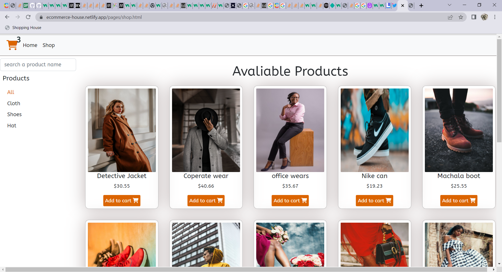
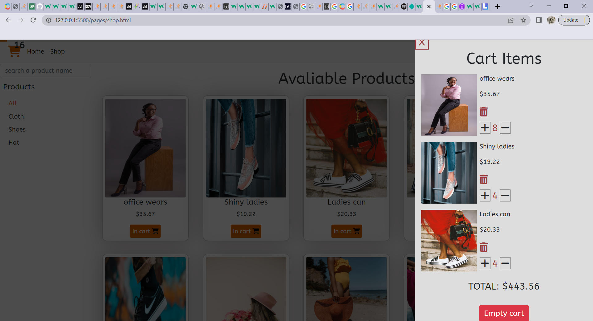

My first vanilla Javascript website, no frame work used 🤷‍♂️
--------------------------------------------------------
This project is built around Javascript ECMAScript 6 (Es6) best Practice such as
- Class ✔
- moduele, import & export ✔
- spread operators ✔
- object destructing ✔
- Array methods ✔
- Arrow functions e.t.c ✔

cart items are stored in the browser's local storage inorder to populate the cart values as the page refreshes

And also, The use of #Contentful for Javascript SDK platform with content Delivery API and content Managemnt API to display data on the webpage. 🚀

link https://ecommerce-house.netlify.app 👌

Image Demo of the site 😎
----------------------

